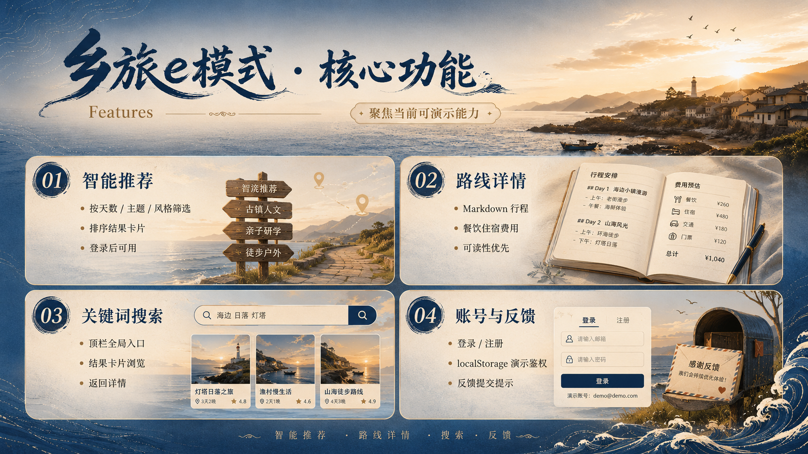
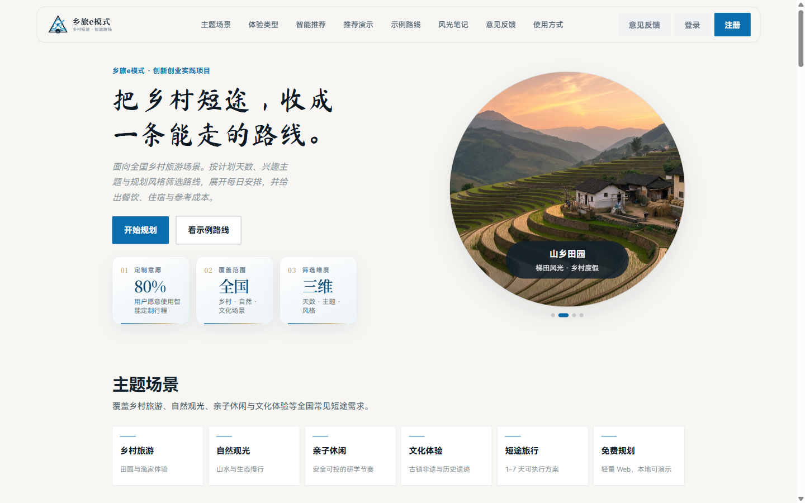
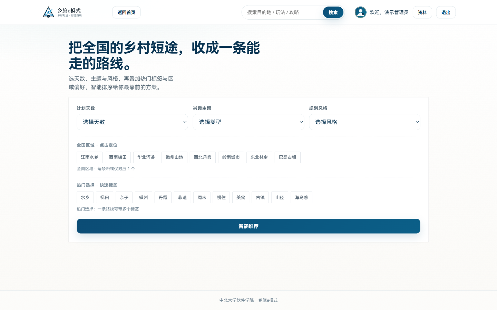
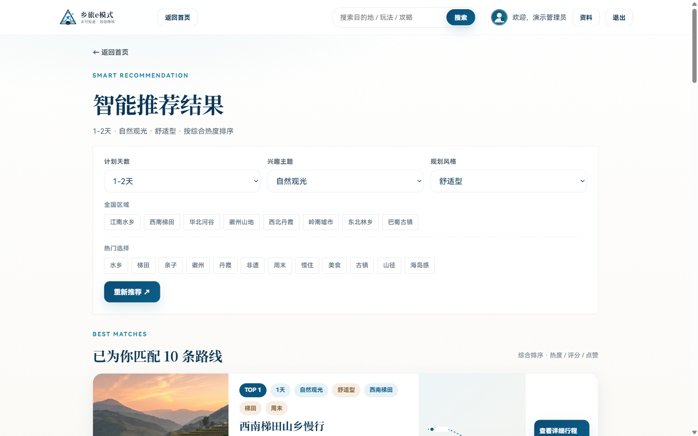
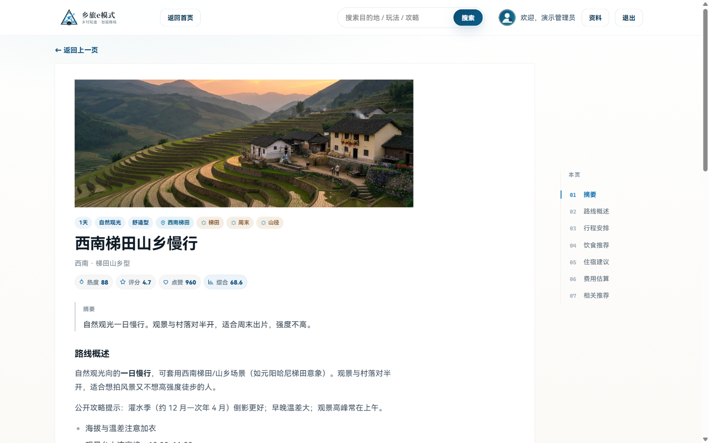
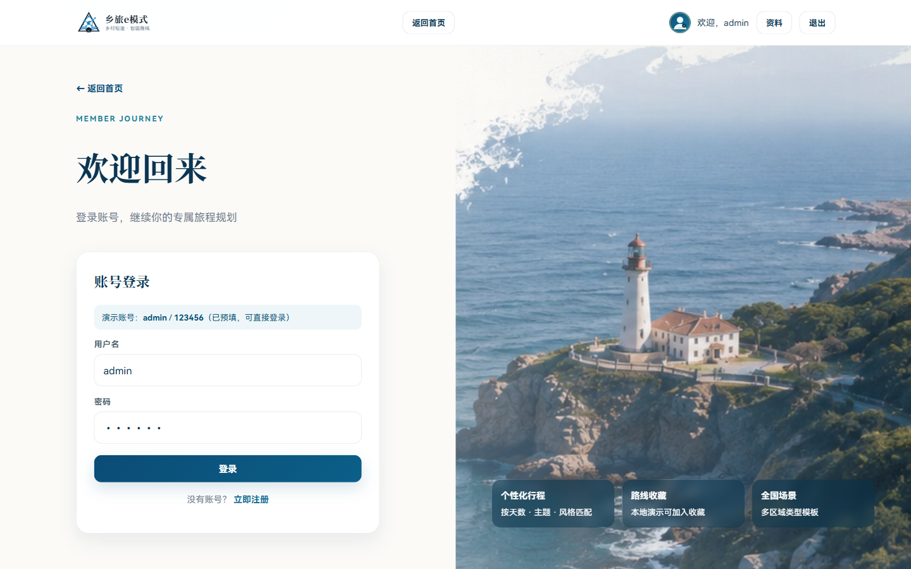
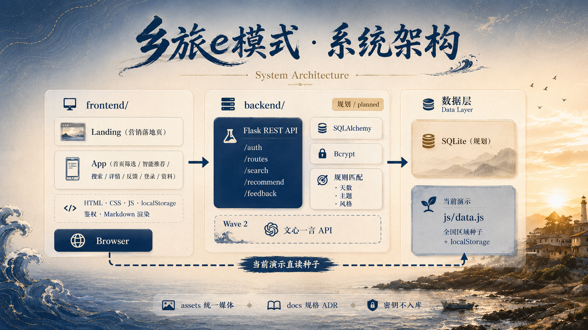
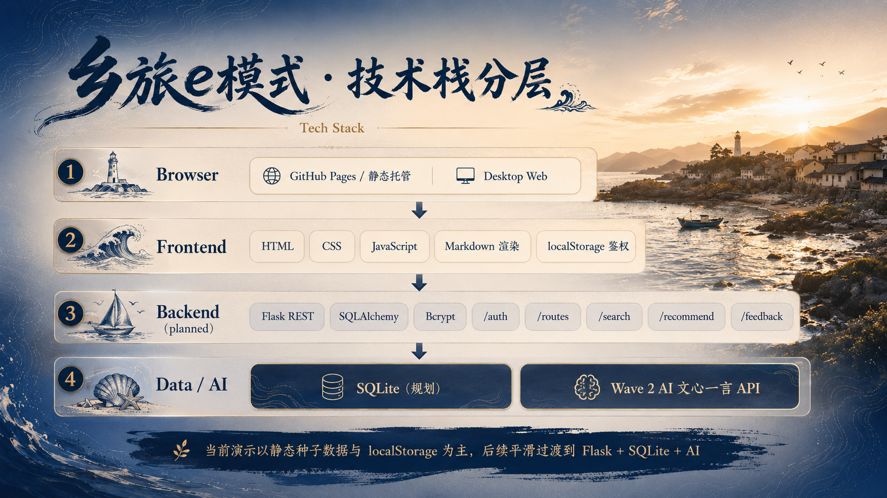
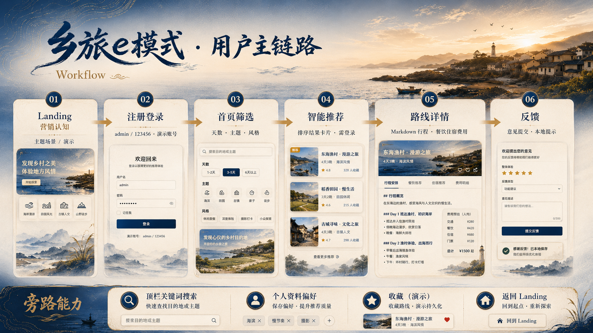

<div align="center">

# Rural Trip e-Mode · Nationwide Rural Short-Trip Route Planner

*From scattered guides and fragmented tips, assemble a rural itinerary you can actually take, finish, and explain.*

A lightweight **nationwide** Web demo for rural tourism, nature sightseeing, family leisure, and cultural experiences.  
Instead of dumping a list of spots, it filters by **trip length · interest theme · planning style** with explainable rules, then expands into daily schedules, dining, lodging, and cost references — turning “I want a countryside getaway” into an executable route.

<p>
  <a href="README.md">中文</a> · <strong>English</strong>
</p>

</div>

<p align="center">
  
</p>

<p align="center">
  
  
  
  
  <a href="https://github.com/Aafff623/xianghai-yuntu/stargazers"></a>
</p>

<p align="center">
  <a href="#why-this-system">Why</a> ·
  <a href="#features">Features</a> ·
  <a href="#demo--showcase">Demo</a> ·
  <a href="#quick-start">Quick Start</a> ·
  <a href="#architecture">Architecture</a> ·
  <a href="#user-journey">Journey</a> ·
  <a href="#roadmap">Roadmap</a> ·
  <a href="#documentation">Docs</a>
</p>

---

## Why this system

When planning a short rural trip, users often hit these gaps:

- Guides are scattered — hard to stitch into a **walkable day-by-day itinerary**;
- Generic OTAs focus on tickets and hotels, with weak **explainable matching** on days / theme / budget style;
- Surveys show strong appetite for smart customization, but there is no lightweight, demo-ready Web loop.

Wave 1 of Rural Trip e-Mode therefore focuses on:

| Capability | Responsibility |
|---|---|
| Smart recommendations | Trip length · interest theme · planning style + hot tags / regions |
| Route details | Overview, schedule, dining / lodging / cost (Markdown) |
| Keyword search | Fuzzy search over nationwide regional type templates |
| Auth | Local demo login; default `admin` / `123456` |
| Profile | Preferences and bio |
| Feedback | Dual entry on Landing + App |
| Data scope | **Nationwide regional types** — not locked to a single city POI library |

---

## Features

<p align="center">
  
</p>

| Feature | Description |
|---|---|
| **Landing** | Marketing page: scenarios, recommendation demo, travel notes, feedback, product rhythm |
| **Register / Login / Logout** | Hard-coded demo account; top bar user state and “Back to home” |
| **Home filters** | Three dropdowns + tags → smart recommendations |
| **Smart search results** | Ranked cards, favorite demo, view details |
| **Route detail** | Markdown body, related links, related recommendations |
| **Keyword search** | Nationwide regional type lookup |
| **Profile** | Bio and default filter preferences |
| **Feedback** | Landing section + in-app feedback page |

> **Wave 1 boundary:** No real payments, inventory, government portal, or AR/VR; Ernie Bot integration is Wave 2. Flask backend is planned; the frontend can be fully demoed with a static server.

Acceptance checklist → [`docs/knowledge/mvp-product-spec.md`](docs/knowledge/mvp-product-spec.md)

---

## Demo / Showcase

### Recommended demo path

```text
Landing — product overview
  → Register / Login (admin / 123456)
  → Home three-axis filters → smart recommendation list
  → Route detail (schedule document)
  → Top-bar search / profile / feedback
  → “Back to home” returns to Landing
```

### Playwright screenshot gallery

Captured via local static server + Playwright; all paths under `assets/readme/`.

<table>
  <tr>
    <td width="50%" align="center">
      <br/>
      <sub>Landing · marketing page</sub>
    </td>
    <td width="50%" align="center">
      <br/>
      <sub>App · home filters</sub>
    </td>
  </tr>
  <tr>
    <td width="50%" align="center">
      <br/>
      <sub>App · smart recommendations</sub>
    </td>
    <td width="50%" align="center">
      <br/>
      <sub>App · route detail</sub>
    </td>
  </tr>
  <tr>
    <td width="50%" align="center">
      <br/>
      <sub>App · login (demo account pre-filled)</sub>
    </td>
    <td width="50%" align="center">
      <br/>
      <sub>Brand · logo.svg</sub>
    </td>
  </tr>
</table>

<details>
<summary>UI page list</summary>

| # | Page | Path |
|---|---|---|
| L1 | Landing | `frontend/landing/index.html` |
| P1 | App home | `frontend/app/index.html` |
| P2 | Login | `frontend/app/login.html` |
| P3 | Register | `frontend/app/register.html` |
| P4 | Smart search | `frontend/app/smart-search.html` |
| P5 | Search | `frontend/app/search.html` |
| P6 | Route detail | `frontend/app/route-detail.html` |
| P7 | Feedback | `frontend/app/feedback.html` |
| P8 | Profile | `frontend/app/profile.html` |

</details>

### Initial nationwide regional types (seed)

| Regional type | Sample route | Days | Theme |
|---|---|---|---|
| Jiangnan water towns | Jiangnan heritage day trip | 1-2 | Cultural experience |
| Southwest terraces | Southwest terrace slow hike | 1-2 | Nature sightseeing |
| North China river valley | North China valley family study tour | 1-2 | Family leisure |
| Huizhou mountains | Huizhou ancient village two-day | 1-2 | Rural tourism |
| Northwest danxia, etc. | See `frontend/app/js/data.js` | 3-5+ | Nature sightseeing, etc. |

---

## Quick start

### Local demo (available now)

```bash
# Clone
git clone https://github.com/Aafff623/xianghai-yuntu.git
cd xianghai-yuntu

# Any static server (repo root)
python -m http.server 8765
```

Open in browser:

| Entry | URL |
|---|---|
| Landing | http://127.0.0.1:8765/frontend/landing/index.html |
| App | http://127.0.0.1:8765/frontend/app/index.html |
| Login | Username `admin` · Password `123456` |

### Full stack (planned)

| Component | Suggested | Notes |
|---|---|---|
| Python | 3.10+ | Flask REST (`backend/` scaffold pending) |
| SQLite | 3 | Dev database |
| Browser | Recent | Static page + API integration |

Tech stack ADR → [`docs/adr/0002-tech-stack-from-backup.md`](docs/adr/0002-tech-stack-from-backup.md)

---

## Architecture

<p align="center">
  
</p>

| Layer | Status | Notes |
|---|---|---|
| **frontend/** | ✅ Demo-ready | Landing + App static pages |
| **backend/** | 🔜 Planned | Flask REST · Bcrypt · SQLAlchemy |
| **assets/** | ✅ | Brand / routes / Showcase (ADR-0001) |
| **docs/** | ✅ | MVP spec, ADRs, Agent workflow |

### Tech stack

<p align="center">
  
</p>

---

## User journey

<p align="center">
  
</p>

**Implementation notes**

- Smart search / search / detail / profile **require login**
- Demo account: `admin` / `123456` (pro avatar: `assets/brand/avatar-admin.svg`)
- App top bar: **Back to home (Landing)** · search · auth state

---

## Directory structure

```text
xianghai-yuntu/   # repo root
├── frontend/
│   ├── landing/          # Marketing landing
│   └── app/              # App pages + js/css
├── backend/              # Flask (planned)
├── assets/
│   ├── brand/            # Logo · admin avatar
│   ├── landing/          # Landing illustrations
│   ├── routes/           # Route images
│   ├── prototype/        # Prototype scenery & refs
│   └── readme/           # README showcase + diagrams
├── docs/                 # Spec · ADR · Agent workflow
├── AGENTS.md · CONTEXT.md · README.md
```

---

## Roadmap

| Phase | Status | Notes |
|---|:---:|---|
| project-init + doc skeleton | ✅ | docs / assets / ADR |
| Landing + App static demo | ✅ | Nationwide scope · auth · Markdown detail |
| README Showcase screenshots | ✅ | Playwright → `assets/readme/` |
| README architecture / journey / features / stack diagrams | ✅ | GPT PNG pack (v2) |
| Flask API + SQLite | 🔜 | Wave 1 backend loop |
| Ernie Bot + SEO | ⚪ | Wave 2 |
| E-commerce / AR / government | ⚪ | Wave 3 vision |

---

## Documentation

| Document | Description |
|---|---|
| [`CONTEXT.md`](CONTEXT.md) | Product domain terms and constraints |
| [`docs/knowledge/mvp-product-spec.md`](docs/knowledge/mvp-product-spec.md) | MVP acceptance source of truth |
| [`docs/adr/0001-assets-directory-for-images.md`](docs/adr/0001-assets-directory-for-images.md) | Images live under `assets/` only |
| [`docs/adr/0002-tech-stack-from-backup.md`](docs/adr/0002-tech-stack-from-backup.md) | Tech stack |
| [`assets/README.md`](assets/README.md) | Global asset index |
| [`assets/readme/README.md`](assets/readme/README.md) | README image contract + **GPT generation spec** |

---

## README image index

| File | Description | Source |
|---|---|---|
| `banner.png` | Hero banner | GPT asset pack v2 |
| `architecture.png` | System architecture | GPT asset pack v2 |
| `workflow.png` | User journey | GPT asset pack v2 |
| `features.png` | Core features | GPT asset pack v2 |
| `tech-stack.png` | Tech stack layers | GPT asset pack v2 |
| `showcase-*.png` | UI gallery | Playwright screenshots |

Contract and naming → [`assets/readme/README.md`](assets/readme/README.md)

---

## About this project

This repo rebuilds a **nationwide rural short-trip** Web demo (historical repo name: `xianghai-yuntu`). Product name: **Rural Trip e-Mode** (乡旅e模式). The old “Shandong seven-city lock-in” narrative is out of Wave 1 scope.

---

## License

See [`LICENSE`](LICENSE) at repo root (MIT).
