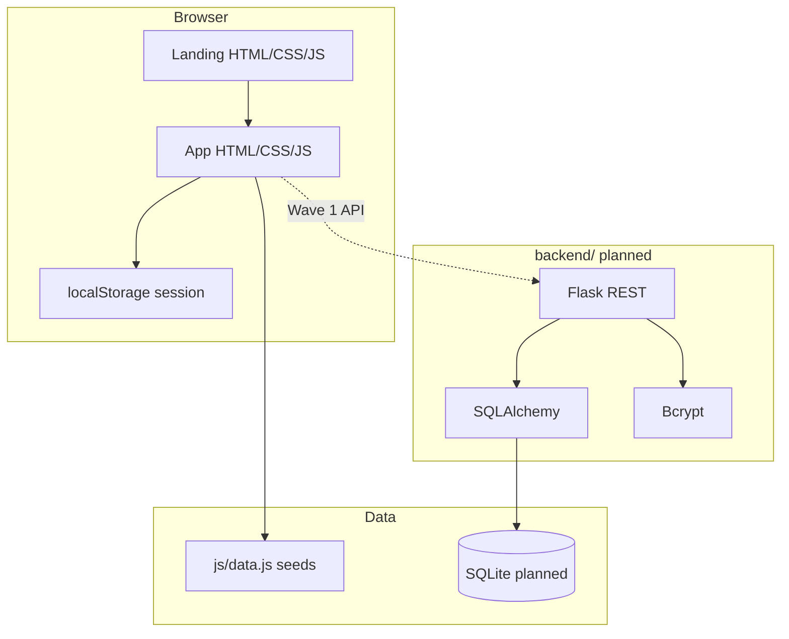
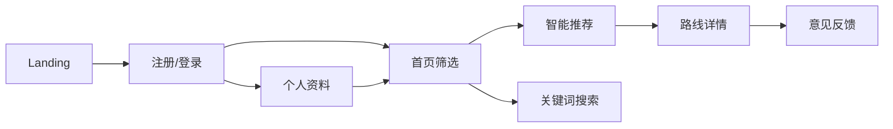

<div align="center">

# 乡旅e模式 · 乡村旅游路线规划 Web 系统

*把全国的乡村短途，收成一条能走的路线。*

面向 **全国** 乡村旅游、自然观光、亲子休闲与文化体验用户的轻量路线规划 Web 演示：按 **天数 · 主题 · 风格** 收敛可执行行程。

<p>
  <strong>中文</strong>
</p>

</div>

<p align="center">
  
</p>

<p align="center">
  
  
  
  
  <a href="https://github.com/Aafff623/xianghai-yuntu/stargazers"></a>
</p>

<p align="center">
  <a href="#为什么需要本系统">为什么</a> ·
  <a href="#功能">功能</a> ·
  <a href="#演示--showcase">演示</a> ·
  <a href="#快速开始">快速开始</a> ·
  <a href="#架构">架构</a> ·
  <a href="#用户主链路">主链路</a> ·
  <a href="#路线图">路线图</a> ·
  <a href="#文档">文档</a>
</p>

---

## 为什么需要本系统

规划乡村短途时，用户常遇到：

- 攻略分散，难以一次拼成 **可走的每日行程**；
- 通用 OTA 偏票务酒店，对 **天数 / 主题 / 预算风格** 的可解释匹配不足；
- 调研中有较高智能定制意愿，但缺少轻量可演示的 Web 闭环。

乡旅e模式 Wave 1 主线收敛为：

| 能力 | 职责 |
|---|---|
| 智能推荐 | 天数 · 兴趣主题 · 规划风格 + 热门标签 / 区域 |
| 路线详情 | 概述、日程、餐饮 / 住宿 / 费用（Markdown） |
| 关键词搜索 | 全国区域类型模板模糊检索 |
| 注册登录 | 本地演示鉴权；默认 `admin` / `123456` |
| 个人资料 | 偏好与简介 |
| 意见反馈 | Landing + App 双入口演示 |
| 数据口径 | **全国区域类型**，不锁单一城市景点库 |

---

## 功能

<p align="center">
  
</p>

| 功能 | 说明 |
|---|---|
| **Landing** | 营销页：场景、推荐演示、风光笔记、反馈、产品节奏 |
| **注册 / 登录 / 登出** | 演示账号写死；顶栏用户态与「返回首页」 |
| **首页筛选** | 三下拉 + 标签 → 智能推荐 |
| **智能推荐结果** | 排序卡片、收藏演示、查看详情 |
| **路线详情** | Markdown 正文、延伸阅读超链接、相关推荐 |
| **关键词搜索** | 全国区域类型检索 |
| **个人资料** | 简介、默认筛选偏好 |
| **意见反馈** | Landing 分栏 + App 反馈页 |

> **Wave 1 边界：** 无真实支付 / 库存 / 政府端 / AR·VR；文心一言为 Wave 2。当前后端 Flask 为规划态，前端可用静态服务器完整演示。

验收清单 → [`docs/knowledge/mvp-product-spec.md`](docs/knowledge/mvp-product-spec.md)

---

## 演示 / Showcase

### 推荐演示路径

```text
Landing 了解产品
  → 注册/登录（admin / 123456）
  → 首页三维筛选 → 智能推荐列表
  → 路线详情（日程文档）
  → 顶栏搜索 / 个人资料 / 反馈
  → 「返回首页」回 Landing
```

### Playwright 截图相册

以下截图由本地静态服务 + Playwright 实机截取，路径均在 `assets/readme/`。

<table>
  <tr>
    <td width="50%" align="center">
      <br/>
      <sub>Landing · 营销落地页</sub>
    </td>
    <td width="50%" align="center">
      <br/>
      <sub>App · 首页筛选</sub>
    </td>
  </tr>
  <tr>
    <td width="50%" align="center">
      <br/>
      <sub>App · 智能推荐</sub>
    </td>
    <td width="50%" align="center">
      <br/>
      <sub>App · 路线详情</sub>
    </td>
  </tr>
  <tr>
    <td width="50%" align="center">
      <br/>
      <sub>App · 登录（演示账号预填）</sub>
    </td>
    <td width="50%" align="center">
      <br/>
      <sub>Brand · logo.svg</sub>
    </td>
  </tr>
</table>

<details>
<summary>UI 页面清单</summary>

| # | 页面 | 路径 |
|---|---|---|
| L1 | Landing | `frontend/landing/index.html` |
| P1 | 功能首页 | `frontend/app/index.html` |
| P2 | 登录 | `frontend/app/login.html` |
| P3 | 注册 | `frontend/app/register.html` |
| P4 | 智能推荐 | `frontend/app/smart-search.html` |
| P5 | 搜索 | `frontend/app/search.html` |
| P6 | 路线详情 | `frontend/app/route-detail.html` |
| P7 | 反馈 | `frontend/app/feedback.html` |
| P8 | 个人资料 | `frontend/app/profile.html` |

</details>

### 首批全国区域类型（种子）

| 区域类型 | 示例路线 | 天数 | 主题 |
|---|---|---|---|
| 江南水乡 | 江南水乡古镇非遗日 | 1-2 | 文化体验 |
| 西南梯田 | 西南梯田山乡慢行 | 1-2 | 自然观光 |
| 华北河谷 | 华北河谷亲子研学 | 1-2 | 亲子休闲 |
| 徽州山地 | 徽州山地古村两日 | 1-2 | 乡村旅游 |
| 西北丹霞 等 | 见 `frontend/app/js/data.js` | 3-5+ | 自然观光 等 |

---

## 快速开始

### 本地演示（当前可用）

```bash
# 克隆
git clone https://github.com/Aafff623/xianghai-yuntu.git
cd xianghai-yuntu   # 或 coding-dev 工作目录

# 任意静态服务器（仓库根）
python -m http.server 8765
```

浏览器打开：

| 入口 | URL |
|---|---|
| Landing | http://127.0.0.1:8765/frontend/landing/index.html |
| App | http://127.0.0.1:8765/frontend/app/index.html |
| 登录 | 用户名 `admin` · 密码 `123456` |

### 全栈（规划中）

| 组件 | 建议 | 备注 |
|---|---|---|
| Python | 3.10+ | Flask REST（`backend/` 待脚手架） |
| SQLite | 3 | 开发库 |
| 浏览器 | 近期版 | 静态页联调 |

技术栈裁定 → [`docs/adr/0002-tech-stack-from-backup.md`](docs/adr/0002-tech-stack-from-backup.md)

---

## 架构

<p align="center">
  
</p>

| 层 | 现状 | 说明 |
|---|---|---|
| **frontend/** | ✅ 可演示 | Landing + App 静态页 |
| **backend/** | 🔜 规划 | Flask REST · Bcrypt · SQLAlchemy |
| **assets/** | ✅ | 品牌 / 路线图 / Showcase（ADR-0001） |
| **docs/** | ✅ | MVP 规格、ADR、Agent 流程 |

### 技术栈

<p align="center">
  
</p>



---

## 用户主链路

<p align="center">
  
</p>



**实现要点**

- 智能推荐 / 搜索 / 详情 / 资料 **需登录**
- 演示账号：`admin` / `123456`（专业头像 `assets/brand/avatar-admin.svg`）
- App 顶栏统一：**返回首页（Landing）** · 搜索 · 登录态

---

## 目录结构

```text
coding-dev/   # 或仓库根
├── frontend/
│   ├── landing/          # 营销落地页
│   └── app/              # 功能页 + js/css
├── backend/              # Flask（规划）
├── assets/
│   ├── brand/            # Logo · 管理员头像
│   ├── landing/          # Landing 插图
│   ├── routes/           # 路线配图
│   ├── prototype/        # 原型风光与参考图
│   └── readme/           # README Showcase + 架构图
├── docs/                 # 规格 · ADR · Agent 流程
├── AGENTS.md · CONTEXT.md · README.md
```

---

## 路线图

| 阶段 | 状态 | 说明 |
|---|:---:|---|
| project-init + 文档骨架 | ✅ | docs / assets / ADR |
| Landing + App 静态演示 | ✅ | 全国口径 · 鉴权 · 详情 MD |
| README Showcase 截图 | ✅ | Playwright → `assets/readme/` |
| README 架构 / 链路 / 功能 / 技术栈图 | ✅ | GPT 高级 PNG（v2 包） |
| Flask API + SQLite | 🔜 | Wave 1 后端闭环 |
| 文心一言 + SEO | ⚪ | Wave 2 |
| 电商 / AR / 政府端 | ⚪ | Wave 3 远景 |

---

## 文档

| 文档 | 说明 |
|---|---|
| [`CONTEXT.md`](CONTEXT.md) | 产品域术语与约束 |
| [`docs/knowledge/mvp-product-spec.md`](docs/knowledge/mvp-product-spec.md) | MVP 验收真相源 |
| [`docs/adr/0001-assets-directory-for-images.md`](docs/adr/0001-assets-directory-for-images.md) | 图片只放 `assets/` |
| [`docs/adr/0002-tech-stack-from-backup.md`](docs/adr/0002-tech-stack-from-backup.md) | 技术栈 |
| [`assets/README.md`](assets/README.md) | 全局资产索引 |
| [`assets/readme/README.md`](assets/readme/README.md) | README 配图契约 + **GPT 出图规格** |

---

## README 配图索引

| 文件 | 说明 | 来源 |
|---|---|---|
| `banner.png` | 页首横幅 | GPT 资产包 v2 |
| `architecture.png` | 系统架构 | GPT 资产包 v2 |
| `workflow.png` | 用户主链路 | GPT 资产包 v2 |
| `features.png` | 核心功能 | GPT 资产包 v2 |
| `tech-stack.png` | 技术栈分层 | GPT 资产包 v2 |
| `showcase-*.png` | 界面相册 | Playwright 实机截图 |

契约与命名说明 → [`assets/readme/README.md`](assets/readme/README.md)

---

## 项目说明

本仓库在 **全国乡村短途** 口径下重建 Web 演示（仓库名历史沿用 `xianghai-yuntu`）。产品名：**乡旅e模式**。旧「山东七市锁定」叙事已退出 Wave 1 主线。

---

## License

见根目录 [`LICENSE`](LICENSE)（MIT）。
