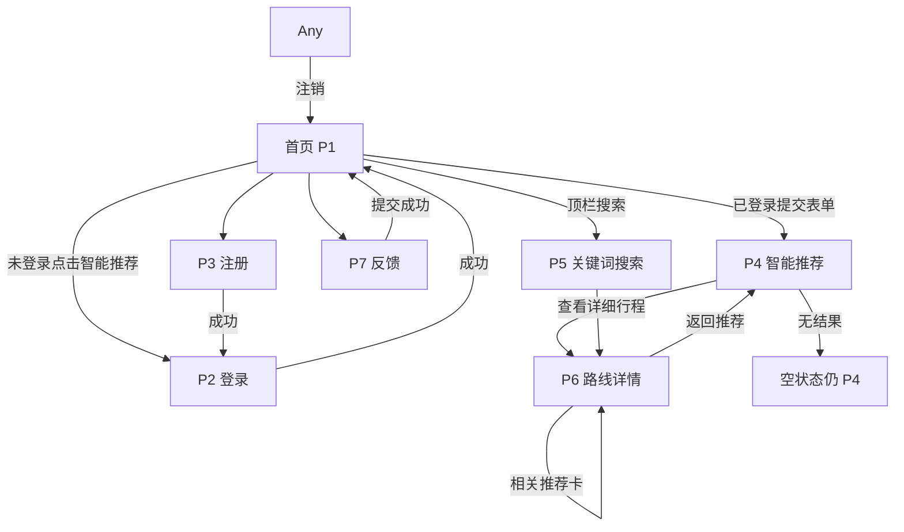

# 乡海云途 前端界面原型出图 Brief

> **用途**：把每个页面的功能点、按钮文案、数据区块、交互状态写清楚，避免「生成一个旅游网站」这类模糊 prompt 导致漏功能、错流程。
>
> **产出目录（终稿）**：`assets/readme/` 或 `assets/prototype/`（出图后按文件名落盘）
>
> **页面数**：**7 个主页面** + **1 套全局壳组件**（导航 / 用户态 / Flash）

---

## 0. MVP 功能清单（出图必须覆盖）

| # | 功能 | 界面落点 | 必现元素 |
|---|------|----------|----------|
| F1 | 智能推荐表单 | 首页 `/` | 三下拉：行程天数、路线类型、预算级别 + 主按钮「智能推荐」 |
| F2 | 智能推荐结果 | `/smart-search` | 路线卡片列表 + 「查看详细行程」 |
| F3 | 相关路线 | `/smart-search` | 区块「其他 N 天路线推荐」≤3 卡 |
| F4 | 无结果态 | `/smart-search` | 指南针图标 + 「未找到匹配的路线」 |
| F5 | 路线详情 | `/routes/:id` | 概述、每日行程时间轴、饮食/住宿/费用三卡、相关推荐 |
| F6 | 注册 | `/register` | 用户名、密码、确认密码、提交 |
| F7 | 登录 | `/login` | 用户名、密码、提交、跳转注册 |
| F8 | 关键词搜索 | 顶栏或首页 | 搜索框 + 「搜索」；**legacy 缺入口，重建必须补** |
| F9 | 关键词结果 | `/search` | 路线卡片（**不含**「匹配的用户」） |
| F10 | 反馈 | `/feedback` | 多行文本框 + 「提交反馈」 |
| F11 | 用户态 | 全局右上角 | 未登录：注册/登录；已登录：欢迎 {用户名} + 注销 |
| F12 | Flash 提示 | 全局顶部居中 | success / danger / info 三类，约 3 秒消失 |
| F13 | 返回导航 | 全局左上 | 「返回首页」；详情页「返回推荐」 |

**下拉选项文案（必须与代码一致）**

| 字段 | 选项 |
|------|------|
| 行程天数 | 选择天数 · 1-2天 · 3-5天 · 6-7天 |
| 路线类型 | 选择类型 · 文化探索 · **海洋风光** · 自然景观 · 美食之旅 · 亲子休闲 · 历史遗迹 |
| 预算级别 | 选择预算 · 经济型 · 舒适型 · 豪华型 |

**示例路线卡（出图用，山东沿海主题）**

1. 即墨古城非遗漫游 · 1天 · 文化探索 · 经济型  
2. 金沙滩海滨休闲 · 1天 · 海洋风光 · 舒适型  
3. 灵山岛赶海体验 · 2天 · 亲子休闲 · 经济型  

**不做进 Wave 1 画面**（避免 AI 乱加）：AI 聊天窗口、购物车、门票支付、地图全屏、管理后台、App 下载、AR/VR、英文界面。

---

## 1. 全局视觉与布局规范

重建版**纠正 legacy 问题**：品牌改为「乡海云途」；配色改回**海洋蓝**（项目书 §3.3.2.2），不用 legacy 山地绿。

```
设计一套现代简洁的中文旅游 Web UI，B/S 平台「乡海云途」。
气质：海洋 + 乡村 · 清新可信 · 竞赛项目但像真实产品。
主色 #0077BE（海洋蓝），辅色 #00B4D8（浅海蓝），点缀 #90E0EF，卡片底 #F8F3E6（沙色）。
背景：海浪渐变 + 可选青岛海岸 Banner（assets/banners/qingdao-sunset-banner.jpg 意象）。
字体：微软雅黑 / 系统无衬线；大标题可用楷体「乡海云途」。
布局：桌面 1200px 宽容器；移动端单列堆叠。
圆角卡片、轻阴影、Font Awesome 线性图标风格。
禁止：legacy 文案「乡旅与山e模式」「中北大学」、山地绿色主题、真实人物照片堆砌。
```

### 1.1 全局顶栏 / 壳组件

| 区域 | 内容 |
|------|------|
| 左 | Logo（三角+e，见 assets/brand/logo-primary.jpg 意象）+ **乡海云途** + 副标「AI 定制化海洋乡村旅游」 |
| 中 | （可选）关键词搜索框 + 搜索按钮 |
| 右 · 未登录 | 文字链 **注册** · **登录** |
| 右 · 已登录 | **欢迎，{用户名}** + 注销图标 |
| 左上浮动 | **返回首页** 胶囊按钮（内页） |

### 1.2 全局 Flash 消息

| 类型 | 色 | 示例文案 |
|------|-----|----------|
| success | 绿渐变 | 注册成功！请登录 / 反馈已提交！ |
| danger | 红渐变 | 请先登录后再使用智能推荐 / 该用户名已被注册 |
| info | 蓝渐变 | 您已成功注销 |

### 1.3 全局页脚

一行：**中国海洋大学 · 乡旅与海 e 模式项目组**（或简写「乡海云途 Demo」）

---

## 2. 页面清单与流程总览

### 2.1 有几个页面？

| # | 路由 | 页面名 | legacy 模板 |
|---|------|--------|-------------|
| P1 | `/` | 首页（含智能推荐表单） | index.html |
| P2 | `/login` | 登录 | login.html |
| P3 | `/register` | 注册 | register.html |
| P4 | `/smart-search` | 智能推荐结果 | smart_search.html |
| P5 | `/search` | 关键词搜索结果 | search.html |
| P6 | `/routes/:id` | 路线详情 | route_detail.html |
| P7 | `/feedback` | 提交反馈 | feedback.html |

**全局壳**：顶栏 + Flash + 页脚（每页复用，可单独出 `prototype-shell.png` 参考）

### 2.2 功能流程（Mermaid）



### 2.3 鉴权流程（重建裁定，与 legacy 对齐并写死）

| 操作 | 需登录 |
|------|--------|
| 浏览首页、注册、登录、反馈 | 否 |
| 智能推荐、关键词搜索、路线详情 | **是** |
| 未登录访问受保护页 | 跳转登录 + Flash「请先登录…」 |

---

## 3. 页面一：首页 `/`

**文件名**：`prototype-home.png`  
**尺寸**：16:9（1920×1080）

### 3.1 信息架构

```
[全局顶栏：Logo + 乡海云途 + 注册/登录 或 用户名]
[Hero 标题：乡海云途]
[副标题：智能路线推荐 - 根据您的需求定制完美行程]
[卡片：三下拉 + 主按钮「智能推荐」]
[快捷入口图标行：注册 | 登录 | 反馈]（未登录时显示前三项）
[页脚]
```

### 3.2 必现元素

- 表单标签：**行程天数** · **路线类型** · **预算级别**
- 主按钮文案：**智能推荐**（legacy submit 同义）
- 机器人图标 + 说明行
- 背景：海浪/海岸意象（非山地）

### 3.3 出图 Prompt

```
{Style 见 §1}

乡海云途旅游平台首页 mockup，中文 UI，桌面浏览器窗口。

顶部：左侧 Logo+「乡海云途」，副标「AI 定制化海洋乡村旅游」；右侧「注册」「登录」链接。

中部大标题「乡海云途」，下方说明「智能路线推荐 - 根据您的需求定制完美行程」。

中央米色圆角卡片内：三个并排下拉框（行程天数/路线类型/预算级别），下方蓝紫渐变圆角大按钮「智能推荐」。

卡片下方三个图标入口：注册、登录、反馈（带 Font Awesome 风格图标）。

背景为海洋蓝渐变+隐约青岛海岸；整体海洋蓝主色 #0077BE，不要绿色山地风。

页脚小字「中国海洋大学 · 乡海云途 Demo」。
```

---

## 4. 页面二：登录 `/login`

**文件名**：`prototype-login.png`

### 4.1 区块

- 左上：**返回首页**
- 标题：**用户登录**（带登录图标）
- 卡片表单：用户名、密码（placeholder「请输入用户名/密码」）
- 主按钮：**登录**
- 底链：没有账号？**立即注册**

### 4.2 出图 Prompt

```
{Style §1}

登录页 mockup。左上「返回首页」胶囊按钮。居中标题「用户登录」。

中间 500px 宽卡片：用户名输入框、密码输入框、蓝色渐变全宽按钮「登录」。
下方「没有账号？立即注册」链接。

海洋蓝背景+沙色卡片，中文，无第三方登录图标。
```

---

## 5. 页面三：注册 `/register`

**文件名**：`prototype-register.png`

- 标题：**注册新账号**
- 字段：用户名、密码、**确认密码**
- 主按钮：**注册**
- 底链：已有账号？**立即登录**

---

## 6. 页面四：智能推荐结果 `/smart-search`

**文件名**：`prototype-smart-search.png`  
**变体**：`prototype-smart-search-empty.png`（无结果）

### 6.1 有结果态信息架构

```
[返回首页] [用户名+注销]
[标题：智能路线推荐]
[重复搜索表单：三下拉 + 智能推荐按钮]
[区块：★ 为您推荐的路线]
  └─ 路线卡 ×N（示例 2 张）
[区块：🧭 其他2天路线推荐]
  └─ 小卡 ×3
```

### 6.2 单张路线卡必现字段

| 区域 | 内容 |
|------|------|
| 头部渐变条 | 路线名 + 元信息胶囊：N天 · 类型 · 预算 |
| 正文 | 路线概述 · 饮食推荐 · 费用估算 |
| CTA | **查看详细行程** |

**示例卡 1 文案**：即墨古城非遗漫游 | 1天 | 文化探索 | 经济型

### 6.3 无结果态

- 大指南针图标
- **未找到匹配的路线**
- 副文：请尝试调整搜索条件…

### 6.4 出图 Prompt（有结果）

```
{Style §1}

智能推荐结果页 mockup。标题「智能路线推荐」。上方保留三下拉筛选表单和「智能推荐」按钮。

下方「为您推荐的路线」区块，2 张大路线卡：
- 卡1「即墨古城非遗漫游」标签 1天/文化探索/经济型，含概述、饮食、费用段落，按钮「查看详细行程」
- 卡2「金沙滩海滨休闲」1天/海洋风光/舒适型

再下方「其他2天路线推荐」3 张小卡横向排列。

海洋蓝主题，中文，已登录态右上角显示「欢迎，demo_user」和注销图标。
```

---

## 7. 页面五：关键词搜索 `/search`

**文件名**：`prototype-search.png`

> legacy 无首页搜索框；重建版顶栏应带搜索入口，本页为结果页。

### 7.1 区块

- 标题：**搜索结果**
- 副标题或标签：关键词「金沙滩」
- 路线卡列表（同 smart-search 简化版，含详情/住宿/饮食）
- 无结果：「未找到匹配结果」

**禁止出现**：「匹配的用户」区块（legacy 有，重建移除）

---

## 8. 页面六：路线详情 `/routes/:id`

**文件名**：`prototype-route-detail.png`

### 8.1 信息架构

```
[返回推荐]（非返回首页）
[标题：路线名]
[元信息胶囊：N天行程 · 类型 · 预算]
[路线概述]
[详细行程安排 - 按天卡片]
  第1天：09:00-12:00 活动…
[行程详情三卡网格：饮食推荐 | 住宿建议 | 费用估算]
[其他N天路线推荐 - 3卡]
```

### 8.2 出图 Prompt

```
{Style §1}

路线详情页 mockup。左上「返回推荐」。大标题「即墨古城非遗漫游」。
三个胶囊：1天行程 / 文化探索 / 经济型。

「路线概述」段落。

「详细行程安排」：第1天卡片含时间轴「09:00-12:00 参观县衙、文庙…」。

下方三列信息卡：饮食推荐、住宿建议、费用估算（含「¥100/人」类文字）。

底部「其他1天路线推荐」2-3 小卡。

海洋蓝+沙色，中文。
```

---

## 9. 页面七：反馈 `/feedback`

**文件名**：`prototype-feedback.png`

- 标题：**提交反馈**
- 大文本域（placeholder「请输入您的意见或建议…」）
- 主按钮：**提交反馈**
- 左上返回首页

---

## 10. 可选变体与移动端

| 文件 | 说明 |
|------|------|
| `prototype-home-mobile.png` | 9:16，表单单列 |
| `prototype-smart-search-mobile.png` | 路线卡单列 |
| `prototype-login-required.png` | 登录页 + Flash「请先登录后再使用智能推荐」 |

---

## 11. 文件名契约总表

| 文件 | 页面 | 状态 |
|------|------|------|
| `prototype-home.png` | 首页 | 待出图 |
| `prototype-login.png` | 登录 | 待出图 |
| `prototype-register.png` | 注册 | 待出图 |
| `prototype-smart-search.png` | 智能推荐（有结果） | 待出图 |
| `prototype-smart-search-empty.png` | 智能推荐（无结果） | 待出图 |
| `prototype-search.png` | 关键词搜索 | 待出图 |
| `prototype-route-detail.png` | 路线详情 | 待出图 |
| `prototype-feedback.png` | 反馈 | 待出图 |

落盘建议：`assets/prototype/`（与 `assets/readme/` 分开）

---

## 12. 自检清单（Grok 出图后对照）

- [ ] 品牌为「乡海云途」，无 legacy 错名
- [ ] 主色海洋蓝，非山地绿
- [ ] 三下拉选项文案与 §0 一致
- [ ] 「智能推荐」「查看详细行程」「提交反馈」CTA 均在
- [ ] 路线卡含 天/类型/预算 三标签
- [ ] 详情页含每日行程时间轴 + 饮食/住宿/费用
- [ ] 无 AI 聊天框、无支付、无购物车
- [ ] 无「匹配的用户」搜索区块
- [ ] 页脚无「中北大学」

---

## 13. 与代码映射（复刻参考）

| UI 元素 | frontend 实现建议 |
|---------|-------------------|
| 三下拉 | `<select>` 或组件库 Select |
| 路线卡 | 卡片组件 + 渐变 header |
| 时间轴 | 按 `daily_schedule` JSON 渲染 |
| Flash |  toast 组件，3s 自动关闭 |
| 鉴权 | API 401 → 跳转 `/login` |

API 契约见 `docs/knowledge/mvp-product-spec.md` §8。
